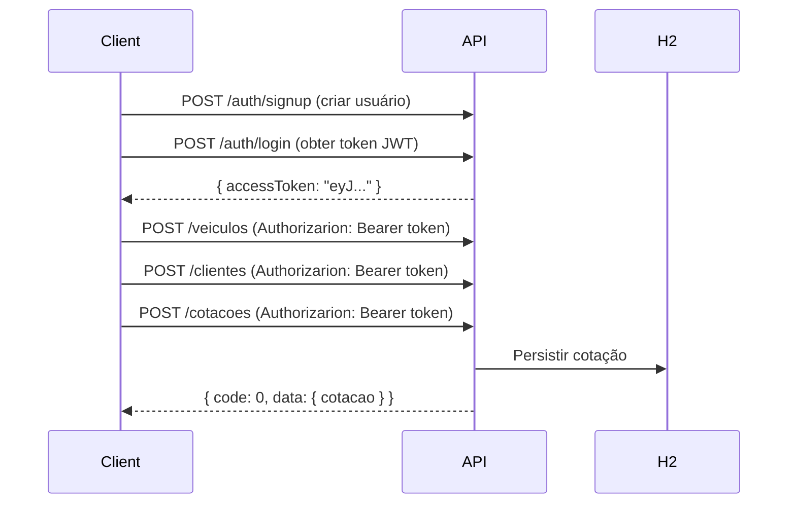

<div align="center">
  <h1>🔐 API de Cotação de Seguros</h1>
  <p><em>REST API para cadastro de clientes, veículos e geração de cotações de seguros com autenticação JWT</em></p>
</div>

<p align="center">
  
  
  
  
  
  
</p>

---

## 📋 Índice

- [Sobre o Projeto](#-sobre-o-projeto)
- [Stack Tecnológica](#-stack-tecnológica)
- [Arquitetura](#-arquitetura)
- [Endpoints](#-endpoints)
- [Fluxo de Uso](#-fluxo-de-uso)
- [Como Executar](#-como-executar)
- [Exemplos com cURL](#-exemplos-com-curl)
- [Códigos de Resposta](#-códigos-de-resposta)
- [Documentação Adicional](#-documentação-adicional)

---

## 📌 Sobre o Projeto

Esta API permite o gerenciamento completo de:

- **👤 Usuários** — Cadastro e autenticação com JWT
- **🧑 Clientes** — CRUD de pessoas físicas/jurídicas seguradas
- **🚗 Veículos** — CRUD de automóveis a serem segurados
- **📄 Cotações** — Geração e gerenciamento de cotações de seguro, vinculando cliente e veículo

Todas as respostas seguem um padrão unificado `ApiResponse<T>`, facilitando o consumo por qualquer cliente HTTP.

---

## 🛠 Stack Tecnológica

| Categoria | Tecnologia | Versão |
|-----------|-----------|--------|
| **Linguagem** | Java | 8+ |
| **Framework** | Spring Boot | 2.7.18 |
| **Autenticação** | Spring Security + jjwt (JWT HS256) | 0.11.5 |
| **Persistência** | Spring Data JPA + Flyway | 9.22.3 |
| **Banco de Dados** | H2 (in-memory) | — |
| **Documentação** | Springfox Swagger | 3.0.0 |
| **DTO Mapping** | MapStruct | 1.5.5 |
| **Build** | Maven | — |
| **Outros** | Lombok, Bean Validation | — |

---

## 🏗 Arquitetura

O projeto segue uma arquitetura em camadas com responsabilidades bem definidas:

```
com.cotacao.seguros
│
├── 📂 controller        # Interface REST (endpoints)
├── 📂 service           # Regras de negócio (casos de uso)
├── 📂 repository        # Acesso a dados (Spring Data JPA)
├── 📂 entity            # Entidades JPA (modelo de domínio)
├── 📂 dto               # Objetos de transferência (request/response)
├── 📂 mapper            # MapStruct — conversão entity ↔ DTO
├── 📂 security          # JWT, filtros, UserDetailsService
├── 📂 config            # Swagger, Security Chain, Password Encoder
├── 📂 exception         # Tratamento global + ApiResponse wrapper
└── 📂 enums             # Códigos padronizados de erro/sucesso
```

**Principais características:**
- ✅ Separação clara entre camadas (Controller → Service → Repository)
- ✅ Padrão DTO para desacoplar a representação interna da externa
- ✅ Tratamento global de exceções com `@ControllerAdvice`
- ✅ Respostas padronizadas via `ApiResponse<T>`
- ✅ Autenticação stateless via JWT com filtro customizado

---

## 🔌 Endpoints

### Autenticação

| Método | Endpoint | Descrição | Autenticação |
|--------|----------|-----------|:------------:|
| `POST` | `/auth/signup` | Cadastrar novo usuário | ❌ |
| `POST` | `/auth/login` | Autenticar e obter token JWT | ❌ |

### Clientes

| Método | Endpoint | Descrição | Autenticação |
|--------|----------|-----------|:------------:|
| `POST` | `/clientes` | Criar novo cliente | ✅ |
| `GET` | `/clientes` | Listar todos os clientes | ✅ |
| `GET` | `/clientes/{id}` | Buscar cliente por ID | ✅ |

### Veículos

| Método | Endpoint | Descrição | Autenticação |
|--------|----------|-----------|:------------:|
| `POST` | `/veiculos` | Cadastrar novo veículo | ✅ |
| `GET` | `/veiculos` | Listar todos os veículos | ✅ |
| `GET` | `/veiculos/{id}` | Buscar veículo por ID | ✅ |

### Cotações

| Método | Endpoint | Descrição | Autenticação |
|--------|----------|-----------|:------------:|
| `POST` | `/cotacoes` | Gerar nova cotação (vincula cliente + veículo) | ✅ |
| `GET` | `/cotacoes` | Listar todas as cotações | ✅ |
| `PUT` | `/cotacoes/{id}` | Atualizar cotação existente | ✅ |

> 🔒 **Endpoints protegidos** exigem o header: `Authorization: Bearer <token>`

---

## 🔄 Fluxo de Uso



**Passo a passo:**

1. **Criar usuário** → `POST /auth/signup`
2. **Autenticar** → `POST /auth/login` → recebe o token JWT
3. **Adicionar veículo** → `POST /veiculos` (com token)
4. **Adicionar cliente** → `POST /clientes` (com token)
5. **Gerar cotação** → `POST /cotacoes` informando `idCliente` e `idVeiculo` (com token)

---

## 🚀 Como Executar

### Pré-requisitos

- [Java 8+](https://adoptium.net/) (JDK)
- [Maven 3.6+](https://maven.apache.org/download.cgi)

### Passos

```bash
# 1. Clone o repositório
git clone https://github.com/seu-usuario/api-cotacao-seguros.git
cd api-cotacao-seguros

# 2. Execute com Maven
mvn spring-boot:run
```

A aplicação iniciará em `http://localhost:8080`.

### Acessos

| Recurso | URL |
|---------|-----|
| **API Base** | `http://localhost:8080` |
| **Swagger UI** | `http://localhost:8080/swagger-ui/` |
| **Console H2** | `http://localhost:8080/h2-console` |

> **Credenciais H2:** JDBC URL: `jdbc:h2:mem:segurosdb` | User: `sa` | Password: *(vazio)*

---

## 🧪 Exemplos com cURL

### 1. Criar usuário

```bash
curl -X POST http://localhost:8080/auth/signup \
  -H "Content-Type: application/json" \
  -d '{"email":"admin@email.com","password":"123456"}'
```

### 2. Login (obter token)

```bash
curl -X POST http://localhost:8080/auth/login \
  -H "Content-Type: application/json" \
  -d '{"email":"admin@email.com","password":"123456"}'
```

Resposta:
```json
{
  "code": 0,
  "message": "OK",
  "data": {
    "accessToken": "eyJhbGciOiJIUzI1NiJ9..."
  }
}
```

### 3. Criar cliente (autenticado)

```bash
curl -X POST http://localhost:8080/clientes \
  -H "Content-Type: application/json" \
  -H "Authorization: Bearer SEU_TOKEN_AQUI" \
  -d '{
    "nome": "João Silva",
    "cpf": "123.456.789-00",
    "email": "joao@email.com",
    "telefone": "(11) 99999-8888"
  }'
```

### 4. Criar veículo (autenticado)

```bash
curl -X POST http://localhost:8080/veiculos \
  -H "Content-Type: application/json" \
  -H "Authorization: Bearer SEU_TOKEN_AQUI" \
  -d '{
    "placa": "ABC-1234",
    "marca": "Toyota",
    "modelo": "Corolla",
    "ano": 2024,
    "valor": 120000.00
  }'
```

### 5. Gerar cotação (autenticado)

```bash
curl -X POST http://localhost:8080/cotacoes \
  -H "Content-Type: application/json" \
  -H "Authorization: Bearer SEU_TOKEN_AQUI" \
  -d '{
    "idCliente": 1,
    "idVeiculo": 1
  }'
```

---

## 📊 Códigos de Resposta

Todas as respostas seguem o formato `ApiResponse<T>`:

```json
{
  "code": 0,
  "message": "Operação realizada com sucesso",
  "data": { /* payload */ }
}
```

| Código | Significado |
|:------:|-------------|
| `0` | ✅ Sucesso |
| `-1` | ❌ Erro genérico |
| `1` | ⚠️ Erro de parâmetro |
| `2` | 📧 Email duplicado |
| `3` | 🆔 CPF duplicado |
| `4` | 🔍 Recurso não encontrado |
| `5` | 🔒 Não autorizado |
| `6` | ✅ Erro de validação |

---

## 📚 Documentação Adicional

- [`ENDPOINTS.md`](anotation/ENDPOINTS.md) — Descrição detalhada de cada endpoint com exemplos
- [`TESTES_CURL.md`](anotation/TESTES_CURL.md) — Scripts completos de teste com cURL
- [Swagger UI](http://localhost:8080/swagger-ui/) — Documentação interativa (em execução)

---

<div align="center">
  <p>Desenvolvido com 💙 usando <a href="https://spring.io/projects/spring-boot">Spring Boot</a></p>
</div>
